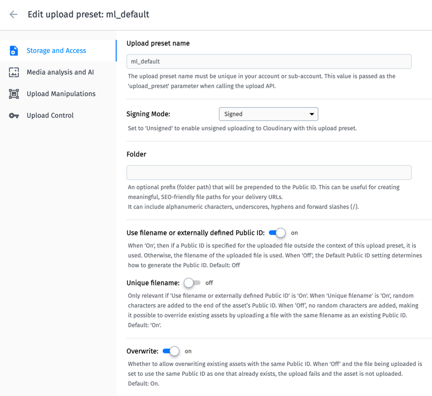

# Configuration

## Commands

```
python manage.py startapp app_name


npm create vite@latest
npm install
npm run dev
npx vite build
```

## Django Cleanup

### Setup

* Install library: [django-cleanup](https://pypi.org/project/django-cleanup/)

#### Update `settings.py`

```
INSTALLED_APPS = (
    ...,
    
    # Must be on the bottom of INSTALLED_APPS.
    'django_cleanup.apps.CleanupConfig',
)
```

> Note: It does not delete files in local deployment. It deletes file in production i.e. cloudinary.

## Cloudinary

### Setup

* Install library: [django-cloudinary-storage](https://pypi.org/project/django-cloudinary-storage/)

#### Update `settings.py`

```
INSTALLED_APPS = [
    # ...
    'django.contrib.staticfiles',
    'cloudinary_storage',
    'cloudinary',
    # ...
]

CLOUDINARY_STORAGE = {
    'CLOUD_NAME': 'your_cloud_name',
    'API_KEY': 'your_api_key',
    'API_SECRET': 'your_api_secret'
}

MEDIA_URL = '/media/'  # or any prefix you choose
DEFAULT_FILE_STORAGE = 'cloudinary_storage.storage.MediaCloudinaryStorage'
```

### Configration

* Updated the cloudinary upload configuration as shown in the screenshot.



### Upload Default Profile Picture

* Login and upload the profile picture. You need to create the parent directory "media".
* The file will automatically get renamed. But you just need to change back the file name i.e. "profile-picture".
* The file extension is not visible but it is same as the uploaded one. So, you do not need to add an extension.

## Generate ER Diagram

### Setup

* Install [django-extensions](https://django-extensions.readthedocs.io/)

```
pip install django-extensions
pip install graphviz
pip install pydotplus
```

```python
INSTALLED_APPS = [
    ...,
    "django_extensions",
]
```

### Run

* Run `python manage.py graph_models -a -g -o models.png`
